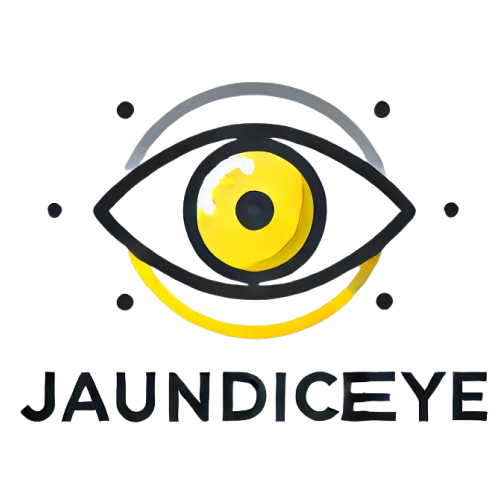
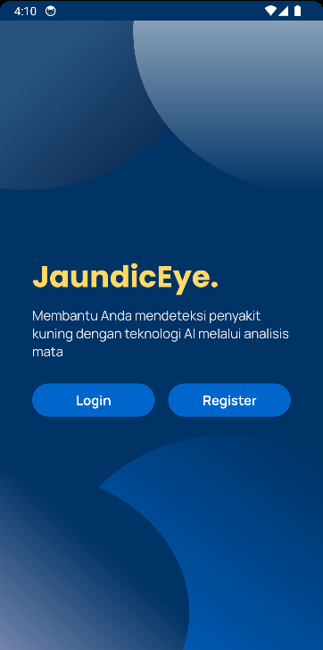
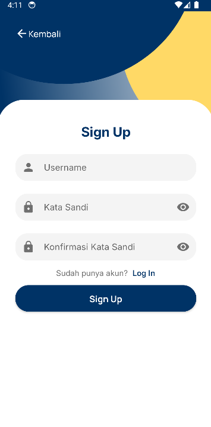
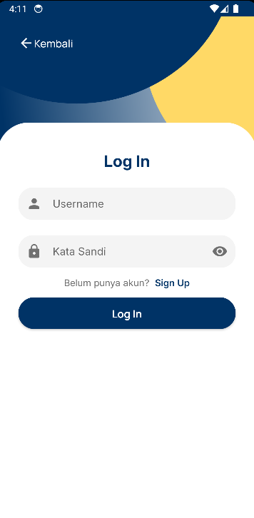
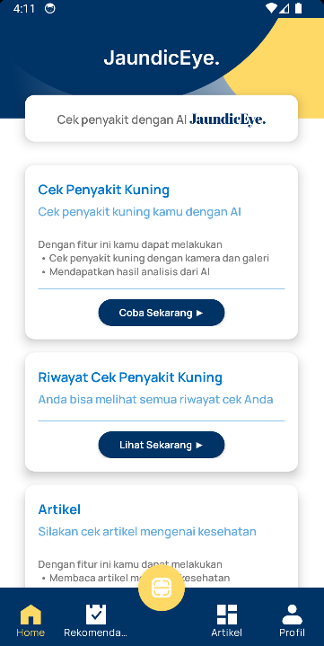
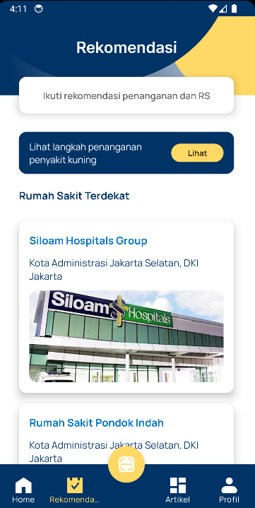
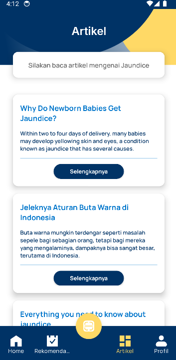
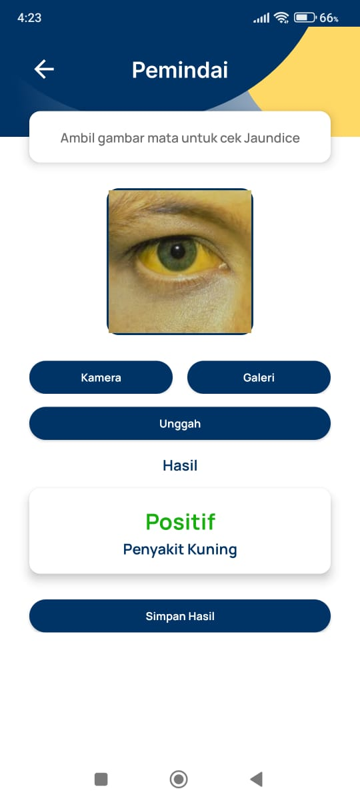
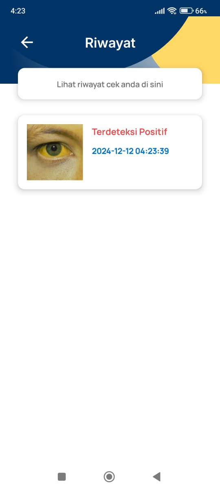

<h1 align="center">
  </img>
<br>
JAUNDICEYE: AI-powered Jaundice Detection and Care Companion
</h1>

# Profile

## Team Members

<div> 
<table>
    <tr>
        <td colspan=4 align="center" style="font-weight:bold">Team ID C242-PS154</td>
    </tr>
    <tr>
        <td>No.</td>
        <td>Name</td>
        <td>Student ID</td>
        <td>University</td>
    </tr>
    <tr>
        <td>1.</td>
        <td>Ahmad Yusuf Farhat</td>
        <td>M002B4KY0237 </td>
        <td>Institut Teknologi Bandung</td>
    </tr>
    <tr>
        <td>2.</td>
        <td>Muhammad Shulhan</td>
        <td>M002B4KY3089</td>
        <td>Institut Teknologi Bandung</td>
    </tr>
    <tr>
        <td>3.</td>
        <td>Rafi Izza Rizaldi</td>
        <td>M002B4KY3582</td>
        <td>Institut Teknologi Bandung</td>
    </tr>
    <tr>
        <td>4.</td>
        <td>Michael Sihotang</td>
        <td>C002B4KY2487</td>
        <td>Institut Teknologi Bandung</td>
    </tr>
    <tr>
        <td>5.</td>
        <td>Nicholas Chikara Manik</td>
        <td>C002B4KY3354</td>
        <td>Institut Teknologi Bandung</td>
    </tr>
    <tr>
        <td>6.</td>
        <td>Arifuddin Achmad Subagja</td>
        <td>A002B4KY0645</td>
        <td>Institut Teknologi Bandung</td>
    </tr>
    <tr>
        <td>7.</td>
        <td>Reyhan Putra Ananda</td>
        <td>A002B4KY3772</td>
        <td>Institut Teknologi Bandung</td>
    </tr>
</table>
<br>

# JAUNDICEYE

## Folder
- [JAUNDICEYE - Machine Learning](https://github.com/ReyhanPA/JAUNDICEYE/tree/master/Machine%20Learning)
- [JAUNDICEYE - Cloud Computing](https://github.com/ReyhanPA/JAUNDICEYE/tree/master/Cloud%20Computing)
- [JAUNDICEYE - Mobile Development](https://github.com/ReyhanPA/JAUNDICEYE/tree/master/Mobile%20Development)


## Executive Summary
JAUNDICEYE is an AI-powered mobile health application designed to enable early detection and intervention for jaundice by analyzing eye images. Jaundice affects approximately 60% of full-term newborns and up to 80% of premature infants globally, often signaling underlying issues like liver dysfunction, blood disorders, or bile duct obstructions​ (Cleveland Clinic). Among adults, jaundice can indicate critical liver diseases, affecting 9.5 million people globally, with liver disease ranking as the 11th most common cause of death worldwide​ (SciTech Daily and San Diego Health). Given the accessibility limitations of regular medical screening and the potential consequences of untreated jaundice, early identification is crucial. JAUNDICEYE uses cloud-based backend services to process eye images, analyzing for signs of bilirubin buildup using advanced AI algorithms. Alongside detection, the app offers location-based recommendations for nearby hospitals and guides users with reliable information about jaundice. This approach addresses a key healthcare gap by providing accessible tools for early diagnosis, potentially reducing the health impact and complications of delayed intervention. Our team is committed to leveraging the power of mobile and AI technologies to provide affordable and accessible healthcare solutions worldwide.

## Project Scope
- The Android application can identify jaundice based on a given photo
- The Android application can provide recommendations for actions that can be taken to overcome jaundice along with the nearest hospital
- The Android application can display health articles related to jaundice
- The Android application can provide authentication access to users

## Screenshots

<p align="center">
  
  
  
</p>

<p align="center">
  
  
  
</p>

<p align="center">
  
  
  
</p>

## Minimum Requirement
* Android Studio Koala | 2024.1.1
* Android Device or Android Emulator 
* USB Cable (to Connect Android Device to your Computer)

## Installation

1. Clone this project to your Computer
```shell
git clone https://github.com/ReyhanPA/JAUNDICEYE.git
```

2. Navigate into the cloned repository
```shell
cd JAUNDICEYE
```

3. Navigate into mobile development folder
```shell
cd '.\Mobile Development\'
```

4. Wait for Gradle Build to Finish and finally press the `Run > Run ‘app’`. Now the app has been installed in your phone / emulator. Make sure that you have configured your android device or emulator 

## Installation (Other Way)

1. Download file APK
[JAUNDICEYE APK](https://drive.google.com/file/d/1UntUQoH44A9Nuh92lCqyFaBia13cNB8H/view?usp=sharing)

2. Install that file in your mobile phone and enjoy!